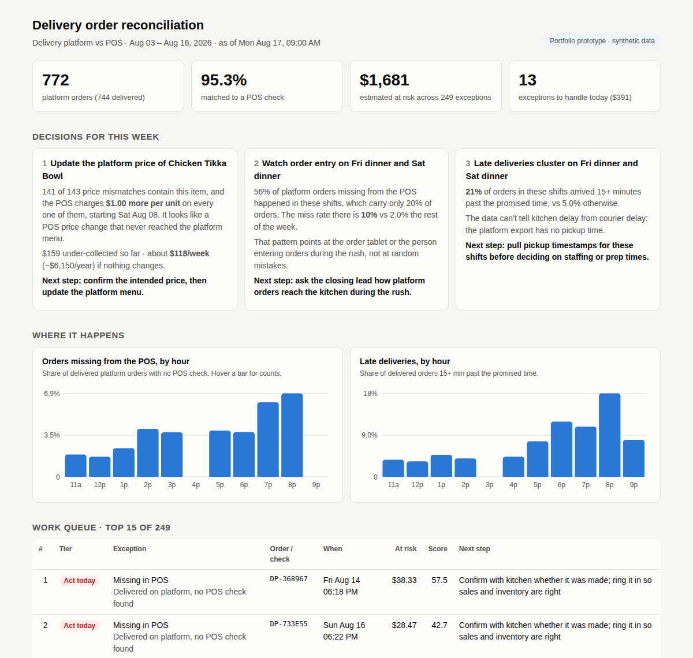

# Restaurant Order Reconciliation

[](https://github.com/shivamparekh618-gif/restaurant-order-reconciliation/actions/workflows/tests.yml)


**Which delivery orders didn't make it into the POS, which ones cost money, and what should the manager fix first?**

A restaurant that takes delivery-app orders has two records of every sale: the delivery platform's export and its own POS. They are supposed to agree, but they don't. Orders get dropped between the tablet and the kitchen, cancelled orders stay on the books, and menu prices drift apart. Usually nobody catches it, because comparing two spreadsheets with different IDs, timezones and formats by hand takes hours.

This project is a small Python + SQL workflow that does the comparison and turns the gaps into a ranked to-do list and a one-page manager view.

> **Portfolio prototype.** The idea comes from the restaurant-operations problems ServiQ works on, but this is not a deployed ServiQ feature and it uses no real ServiQ or customer data. All orders, prices and IDs are synthetic. The generator is in [`recon/generate.py`](recon/generate.py).

**[Open the live manager view →](https://shivamparekh618-gif.github.io/restaurant-order-reconciliation/)**

[](https://shivamparekh618-gif.github.io/restaurant-order-reconciliation/)

### At a glance

| | |
|---|---|
| **Problem** | Delivery-app orders and POS records disagree, and nobody has time to compare them by hand |
| **Data** | 2 weeks, 772 platform orders, 1,528 POS checks (synthetic, with realistic mess) |
| **Built** | Two-pass matching in SQL, 5 exception rules, a scoring model, root-cause checks, one-page HTML view |
| **Accuracy** | 100% match precision, 99.7% recall against the planted answer key |
| **Key finding** | One stale menu price explains 141 of 143 price mismatches, about $6,150/year |

---

## What it does

```
delivery_platform_orders.csv ─┐
                               ├─► clean ─► match ─► flag exceptions ─► prioritize ─► manager view
pos_checks.csv ────────────────┘   (Python)  (SQL)      (SQL)            (Python)       (HTML + CSV)
```

1. **Clean.** Converts both exports to UTC timestamps and integer cents, drops duplicate platform rows, and normalizes the order references staff type into the POS (`dp-8f3a21`, `8F3A21` and `DP 8F3A21` all become `DP-8F3A21`).
2. **Match** ([`sql/02_exact_match.sql`](sql/02_exact_match.sql), [`sql/03_candidate_pairs.sql`](sql/03_candidate_pairs.sql)).
   - Pass 1 joins on the cleaned reference.
   - Pass 2 handles checks with no usable reference. It looks for a delivery-channel POS check opened within 8 minutes of the platform order with a subtotal within $3, then assigns one-to-one, closest pair first.
3. **Flag exceptions** ([`sql/04_exceptions.sql`](sql/04_exceptions.sql)):

   | Exception | What it means | $ at risk |
   |---|---|---|
   | Missing in POS | Delivered on the platform, no POS check | order total |
   | Cancelled, not voided | Platform cancelled it, POS check still live | POS total |
   | Price mismatch | Both have it, subtotals differ by > $0.50 | the difference |
   | Late delivery | Delivered 15+ min after the promised time | 20% of order (assumed refund rate) |
   | POS-only delivery | Delivery-channel POS check with no platform order | POS total |

4. **Prioritize** ([`recon/prioritize.py`](recon/prioritize.py)). Each exception gets a score:
   `score = dollars at risk × type weight × recency`.
   The type weight is how sure we are the money is really at stake (1.0 for a missing order, 0.5 for a late one). Recency is 1.5× for the last 3 days, while staff still remember the shift, and 0.5× past an assumed 7-day dispute window. Scores sort into **Act today / This week / Monitor**.
5. **Look for patterns** ([`recon/patterns.py`](recon/patterns.py)). Working through exceptions one order at a time misses the real fix, so this step asks whether one upstream cause explains a whole group of them.

## Results on the sample data

Two weeks, one location: 772 platform orders and 1,528 POS checks (dine-in and takeout included).

- **95.3%** of platform orders matched to a POS check: 551 by reference, 185 by the time-and-amount fallback. That means a quarter of the matches depended on the fallback.
- **249 exceptions, about $1,681 at risk.** 13 of them ($391) land in *Act today*.
- Checked against the generator's answer key, matching is 100% precise with 99.7% recall. Every missing, cancelled-not-voided, late and POS-only order that was planted got flagged.

## Example decision: the $6,000/year price gap

The work queue has 143 price mismatches, and each one is only $1 to $3. Looked at one at a time, they would all sit in *Monitor* forever.

The pattern step asks which menu item is over-represented in the mismatched orders:

| | Share of mismatched orders | Share of all orders |
|---|---|---|
| Chicken Tikka Bowl | **99%** (141 of 143) | 28% |

On every one of those orders the POS charges **exactly $1.00 more per bowl** than the platform, starting Saturday Aug 8. Nothing before that date. The most likely explanation is that someone raised the price in the POS and never updated the delivery menu.

- Under-collected so far: **$159** in 9 days
- If nothing changes: about **$118/week, roughly $6,150/year**, from one location

**Decision for the manager:** confirm the intended price, then update the platform menu. That single change clears 141 exceptions for good. Working through them order by order would never have fixed the cause.

The other two cards in the manager view work the same way:

- **Missing orders cluster on Friday and Saturday dinner.** 56% of the orders missing from the POS came from shifts that carry 20% of the volume (10% miss rate vs 2%). That points at the tablet or the order-entry process during the rush, not at random mistakes.
- **Late deliveries cluster in the same shifts** (21% vs 5%). The data can't tell kitchen delay from courier delay, so the recommendation is to get pickup timestamps before changing staffing, not to change staffing.

## Run it

Requires Python 3.10+. Standard library only (`sqlite3`, `csv`, `zoneinfo`), nothing to install.

```bash
git clone https://github.com/shivamparekh618-gif/restaurant-order-reconciliation.git
cd restaurant-order-reconciliation

python run.py                 # uses the CSVs in data/
python run.py --regenerate    # rebuild the synthetic data first (seeded, so it's reproducible)
python -m unittest -v         # 10 tests (also run on every push by GitHub Actions)
```

Outputs, all in `output/`:

| File | What's in it |
|---|---|
| `manager_view.html` | The one-page view in the screenshot. Open it in a browser. |
| `exception_queue.csv` | Every exception, ranked, with the score broken into its parts and a next step |
| `matched_orders.csv` | Every platform-to-POS pair and *how* it was matched, so the fuzzy ones can be spot-checked |
| `run_summary.json` | Data-quality counts, match counts, evaluation scores |

`docs/index.html` is a copy of the manager view, served by GitHub Pages as the live demo.

To run it on other exports, replace the two files in `data/` with the same columns (see [`sql/01_schema.sql`](sql/01_schema.sql)) and delete `data/_synthetic_truth.csv`.

## The data

Synthetic, generated by [`recon/generate.py`](recon/generate.py) with a fixed seed. I planted the problems that show up in real exports so the workflow has to deal with them:

| Messy thing | How it shows up |
|---|---|
| Different timezones | Platform exports UTC; POS exports local time |
| Two timestamp formats | POS terminal 1 writes `08/03/2026 06:42 PM`, terminal 2 writes `2026-08-03 18:42:07` |
| Inconsistent references | 65% typed correctly, 10% in a different case or format, 25% blank |
| Messy money and labels | `$` in some amount fields; `Delivery`, `DELIVERY` and `delivery ` as channel names |
| Duplicate export rows | ~1% of platform rows repeated |
| Other channels mixed in | Dine-in and takeout checks share the POS export |
| Operational problems | Tablet drops orders during the Fri/Sat rush, one stale menu price, un-voided cancellations, late deliveries, stray delivery-channel checks, the occasional item removed from a ticket |

The generator also writes `data/_synthetic_truth.csv`, an answer key used only for evaluation. The pipeline never reads it to make decisions.

## Assumptions

All of these live in [`recon/config.py`](recon/config.py) so they can be changed in one place, and all of them should be checked with the people who run the restaurant:

- The restaurant is in `America/Los_Angeles`.
- A POS check typed in by hand is opened within 8 minutes of the platform order, with the subtotal within $3.
- Price differences under $0.50 are rounding and can be ignored.
- "Late" means 15+ minutes past the promised time, and about 20% of a late order's value is lost to refunds or credits.
- Disputes can be filed with the platform for 7 days.
- The type weights (1.0 / 1.0 / 0.8 / 0.6 / 0.5) reflect my guess about how certain each kind of loss is.

## Known limitations

- **Two orders get flagged twice.** When the kitchen removes an item from a ticket, the subtotal gap can exceed the $3 fallback tolerance, so the order shows up as *Missing in POS* and its check as *POS-only delivery*. Next step: pair those two flags up as a "possible match" for a person to confirm, rather than widening the tolerance and risking bad matches.
- **The dollar figures are estimates.** "At risk" is not "lost." A missing POS entry might still have been cooked and delivered, in which case the only damage is to the sales and inventory numbers.
- **One location, two weeks.** A pattern like "Fri/Sat dinner" needs more weeks before anyone should reorganize staffing around it.
- **No pickup time.** Without it, late deliveries can't be split into kitchen delay and courier delay.

## What I'd ask the users before deploying this

1. **How do platform orders physically get into the POS today?** Tablet integration, manual entry, or both? Does it change during the rush? This decides whether "missing in POS" is a process problem or an integration bug.
2. **Who would act on this list, and when?** A GM doing a morning review needs a different view than a shift lead mid-service. It also decides whether this should be a daily email, a screen in the back office, or an alert.
3. **What does the platform payout report look like?** Matching to the payout (after commission and adjustments) is what finance actually cares about. Do you get it per order or as a lump sum?
4. **What's the real dispute window and process for each platform you use?** The recency scoring depends on it.
5. **Which exceptions have you already been handling by hand, and how?** If someone already voids cancellations every night, that exception type is noise for them.
6. **Is a price difference ever intentional?** Some restaurants deliberately charge more on delivery apps to cover commission. If so, the price-mismatch rule needs a per-item allowlist.
7. **What would make you trust a fuzzy match?** I'd want someone to spot-check the fallback matches for a week before the queue counts them as resolved.

## Project layout

```
run.py                   entry point: load → match → flag → prioritize → report
recon/
  config.py              every assumption and threshold, in one place
  generate.py            synthetic data generator (seeded)
  load.py                cleaning and loading into SQLite
  match.py               two-pass matching
  prioritize.py          scoring and tiers
  patterns.py            root-cause checks across exceptions
  evaluate.py            scoring against the synthetic answer key
  report.py              the HTML manager view
sql/                     schema, matching and exception rules
tests/                   unit + end-to-end tests
data/                    sample inputs
output/                  sample outputs from the last run
```
